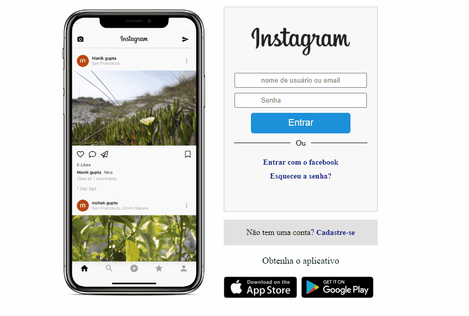

# Desafio de projeto

## Finalidade

Este projeto tem como finalidade mostrar de forma simples e prática como usar o Flexbox no seu dia a dia como desenvolvedor.

Nele foi aplicado alguns conceitos e você pode fazer alterações para adaptar as suas necessidades ou usar como base para seus estudos

## Tecnologias aplicadas

**HTML**
**CSS**

  
